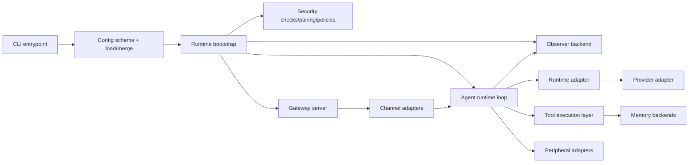

# Architecture Reference: ZeroClaw

## 1) System DNA Snapshot
ZeroClaw is a modular Rust runtime built around trait contracts and factory registration. Most behavior is formed by composition:
- `main.rs` maps CLI command paths
- `lib.rs` defines shared command enums, exports, and boot orchestration
- factories inject concrete adapters for providers, channels, tools, memory, runtime, observability, security, peripherals

## 2) Core Dataflow

### 2.1) Example execution path
- Inbound message → Gateway → Channel adapter → Agent loop → (optional) Tool execution → Memory read/write; observability/log emission at agent and tool layers.

## 3) Boundary Map by Contract Surface
- Config Surface
  - `src/config/schema.rs`
  - CLI loading and merge behavior; config load/merge and consumption at bootstrap and command entry
- Security Surface
  - pairing, policy gates, secret handling, bounded actions
- Provider Surface
  - provider factory, resilience/routing wrappers
- Channel Surface
  - inbound transport + outbound formatting and rate/health semantics
- Tools Surface
  - manifest-based registration + schema validation + execution constraints
- Memory Surface
  - markdown/sqlite/embedding merge behavior and merge policy
- Runtime Surface
  - native/docker/wasm selection
- Plugin Surface
  - manifest, ABI exposure, crate/wrapper compatibility
- Observability Surface
  - logs, metrics, traces, optional cost instrumentation
- Peripheral Surface
  - hardware adapters + tool exposure

Other modules such as goals, coordination, hooks, and skills implement supporting behavior within or across these boundaries.

## 4) Design Invariants
- Traits define stable extension points.
- Factories produce canonical names and route/alias handling is explicit.
- Failures should be visible and explicit rather than silently widened.
- Security boundaries are deny-by-default with narrow blast radius.

## 5) Known Asynchronous and Concurrency Paths
- Channel listener + gateway ingress can trigger agent turns concurrently.
- Provider call chains include retry/fallback behavior through resilient wrappers.
- Memory and tool execution must be observable independently of model interaction for post-facto audit.

## 6) Operational Control Plan
- Preserve existing CLI and config contracts unless spec authoring phase explicitly recommends and tracks a later implementation PR.
- Any future implementation per spec must include:
  - explicit rollback path
  - security boundary validation
  - docs and reference updates
  - i18n follow-through if contract wording changes.

## See also
- [spec-tracking-review.md](spec-tracking-review.md) — spec lifecycle and review gating
- [docs/specs/README.md](docs/specs/README.md) — spec index and format contract
